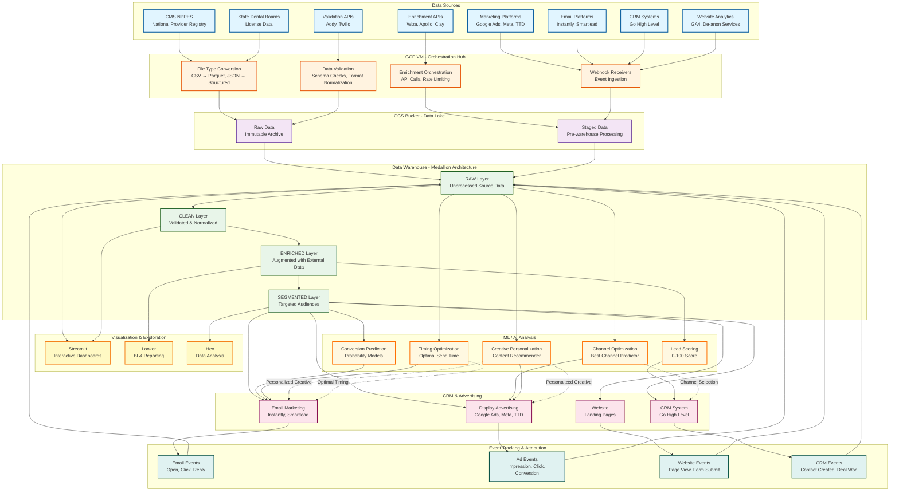
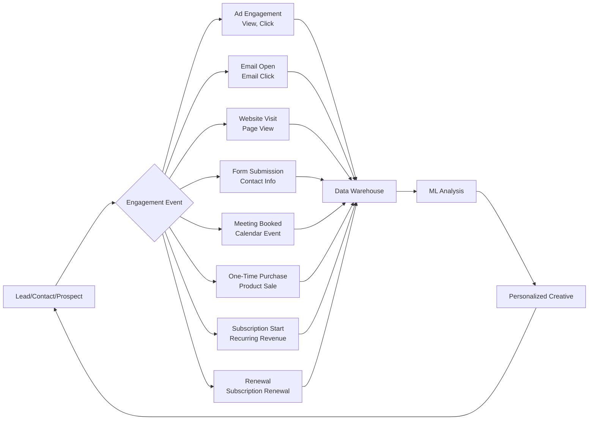

# Data Pipeline Architecture

## System Overview

## Conversion Events Tracked

## Data Flow Stages

### Stage 1: Ingestion
- **Input**: Raw data from sources (CSV, JSON, APIs)
- **Process**: File type conversion, initial validation
- **Output**: Standardized files in GCS

### Stage 2: Transformation (RAW → CLEAN)
- **Input**: Raw data from GCS
- **Process**: 
  - Remove inactive records
  - Filter by criteria (e.g., dental only)
  - Deduplicate
  - Address/phone validation
- **Output**: Clean, validated records

### Stage 3: Enrichment (CLEAN → ENRICHED)
- **Input**: Clean records
- **Process**:
  - Email enrichment (Wiza/Apollo/Clay)
  - LinkedIn profile matching
  - Firmographic data augmentation
- **Output**: Enriched records with contact info

### Stage 4: Segmentation (ENRICHED → SEGMENTED)
- **Input**: Enriched records
- **Process**:
  - ICP scoring
  - Geographic segmentation
  - Practice size estimation
  - Behavioral clustering
- **Output**: Targeted audience segments

### Stage 5: Activation
- **Input**: Segmented audiences
- **Process**: Export to CRM/advertising platforms
- **Output**: Active campaigns

### Stage 6: Feedback Loop
- **Input**: Event data from campaigns
- **Process**: Attribution, event tracking
- **Output**: Event records in RAW layer

### Stage 7: ML Analysis
- **Input**: Historical data (enriched + events)
- **Process**: 
  - Feature engineering
  - Model training
  - Prediction generation
- **Output**: Scores, probabilities, recommendations

### Stage 8: Personalization
- **Input**: ML predictions
- **Process**: Dynamic creative generation
- **Output**: Personalized content per lead/contact

---

## Key Components

### Data Sources
- **CMS NPPES**: National Provider Identifier registry (weekly updates)
- **State Boards**: Dental license data (scraped/API)
- **Enrichment APIs**: Wiza (email), Apollo (person/company), Clay (multi-source)
- **Validation APIs**: Addy (address), Twilio (phone)
- **Marketing Platforms**: Google Ads, Meta, The Trade Desk
- **Email Platforms**: Instantly, Smartlead
- **CRM**: Go High Level
- **Analytics**: GA4, de-anonymization services (RB2B, Leadfeeder)

### VM Functions
- File type conversion (CSV → Parquet, JSON → structured)
- Data validation (schema checks, format normalization)
- Enrichment orchestration (API calls, rate limiting, retries)
- Webhook receivers (event ingestion from all platforms)

### Storage (GCS)
- **Raw Data**: Immutable archive of all source data
- **Staged Data**: Pre-processed data ready for warehouse ingestion

### Data Warehouse (Medallion Architecture)
- **RAW**: Unprocessed source data (immutable)
- **CLEAN**: Validated, normalized, deduplicated
- **ENRICHED**: Augmented with external data (emails, LinkedIn, etc.)
- **SEGMENTED**: Targeted audiences ready for activation

### Visualization Tools
- **Streamlit**: Interactive dashboards for segmentation
- **Looker**: BI reporting and analysis
- **Hex**: Data exploration and ad-hoc analysis

### Activation Channels
- **CRM**: Contact/account management (Go High Level)
- **Email**: Cold email campaigns (Instantly, Smartlead)
- **Display Ads**: Programmatic advertising (Google, Meta, TTD)
- **Website**: Landing pages and forms

### Event Tracking
- Email events: open, click, reply, bounce
- Ad events: impression, click, conversion
- Website events: page view, form submit, demo booked
- CRM events: contact created, deal won, subscription started

### ML/AI Models
- **Lead Scoring**: 0-100 score for prioritization
- **Conversion Prediction**: Probability of conversion event
- **Channel Optimization**: Best channel for each lead
- **Creative Personalization**: Content recommendations per lead
- **Timing Optimization**: Optimal send time prediction

---

## Feedback Loops

### Loop 1: Event → Warehouse → ML → Activation
1. Events flow back to RAW layer
2. ML models analyze patterns
3. Predictions feed into activation channels
4. Personalized creatives generated
5. New events generated
6. Cycle repeats

### Loop 2: Performance → Segmentation → Targeting
1. Campaign performance analyzed
2. Segments refined based on conversion data
3. New segments created
4. Targeted campaigns launched
5. Performance measured
6. Cycle repeats

---

*Last Updated: December 2024*

